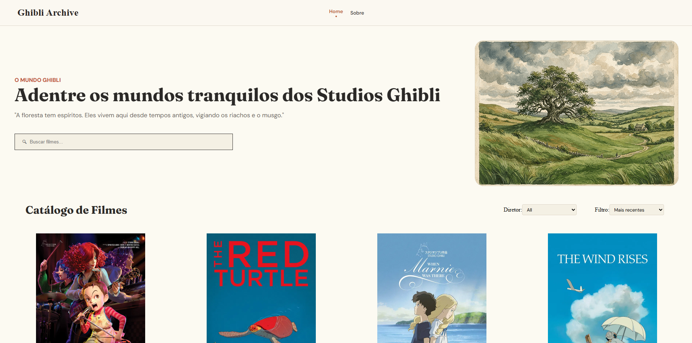
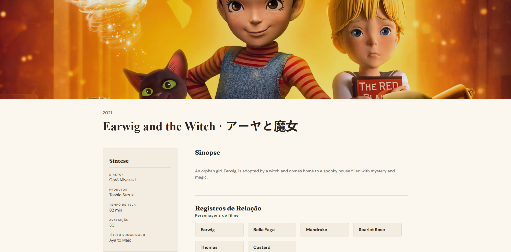
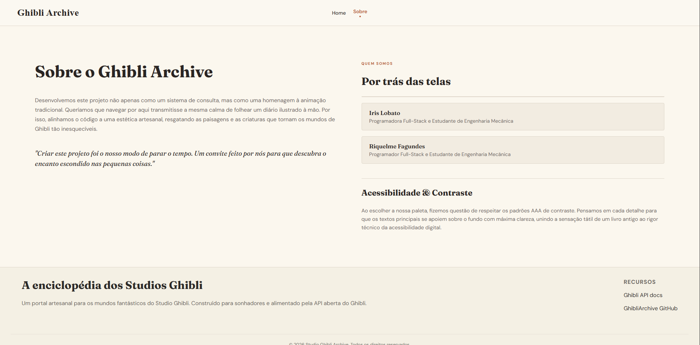

# Ghibli Archive 

Um portal artesanal e arquivo interativo para explorar os mundos fantásticos, filmes e personagens do Studio Ghibli. Desenvolvido com foco em alta performance, acessibilidade (padrões AAA) e uma estética visual inspirada em guias de campo ilustrados à mão.

---

## Capturas de Tela

| Página Inicial (Home) | 



| Página de Detalhes do Filme |



| Página de Detalhes do Personagem |


| Pagina Sobre |



---

## Integrantes do Grupo

* Iris Lobato 
* Riquelme Fagundes

---

## Tecnologias Utilizadas

* *React* & *React Router*
* *Vite*
* *CSS Customizado* (com as fontes Fraunces e DM Sans)
* *Ghibli API* 

---

## Instalação e Execução Local

Para executar este projeto na sua máquina local, siga os passos abaixo:

1. *Pré-requisitos:* Certifique-se de ter o [Node.js](https://nodejs.org/) instalado no seu computador.

2. *Clonar o repositório:*
   ```bash
   git clone [https://github.com/irislobato/ghibli-archive.git]

3. *Ao abrir no VSCode:* Abra o terminal e digite: "npm install", clicando Enter em seguida.

4. *Rodando o site:*Digite, ainda no terminal, "npm run dev", também apertando Enter em seguida.

5. *Visualizando  o site:* Copie o link que o terminal iniciou e cole no seu navegador de preferência.

6. *Caso dê error to fetch no navegador:* Aperte Crtl + Shift + R para recarregar a página de maneira forçada.